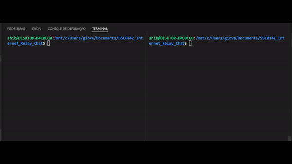

# SSC0142_Internet_Relay_Chat
Projeto de desenvolvimento de um IRC em linguaguem C para a disciplina SSC0142 - Redes de Computadores

<html>
	 
</html>

# Membros

- Giovanni Shibaki Camargo  Nusp: 11796444
- Lucas Keiti Anbo Mihara   Nusp: 11796472
- Vitor Caetano Brustolin   Nusp: 11795589

# Árvore de arquivos do projeto
    .
    ├── Makefile
    ├── README.md
    ├── assets
    │   └── mensagemEnorme.txt
    ├── client
    ├── lib
    │   ├── clientManager.cpp
    │   └── messageManager.cpp
    ├── server
    └── src
        ├── client.cpp
        └── server.cpp

# Como compilar e executar

## Compilar

Para compilar o projeto basta utilizar o comando **make** no arquivo Makefile fornecido, conforme o código abaixo:

> make

Para compilar foi utilizado o compilador **g++** na versão **(Ubuntu 9.4.0-1ubuntu1~20.04.1) 9.4.0**

## Executar

Após compilado, o projeto irá gerar dois arquivos executáveis: **client** e **server**, correspondentes ao programa de usuário e cliente que irão conversar na primeira entrega do projeto.

Para executar o cliente e o servidor, basta utilizar os comandos abaixo:

> make run_client

> make run_server

# Observações

Conforme a específicação do projeto, caso uma mensagem com mais de 4096 caracteres tenha sido enviada por parte do cliente ou servidor, esta mensagem deve ser dividida em partes de 4096. No entanto, o buffer de digitação do terminal tem tamanho 4096 e não permite a utilização do comando de **copiar e colar** para mensagens maiores. Dessa forma, para testar inputs com mais de 4096 caracteres deve ser passado uma arquivo contendo essa mensagem. Para testar, fornecemos um arquivo **.txt** com 4107 caracteres que pode ser utilizado na execução conforme abaixo:

> make run_client < ./assets/mensagemEnorme.txt

Foi também implementado o comando **/exit**. Caso servidor ou cliente digite este comando, a aplicação será finalizada para ambos.

# Referências

- https://datatracker.ietf.org/doc/html/rfc1459
- https://www.rfc-editor.org/info/rfc1459